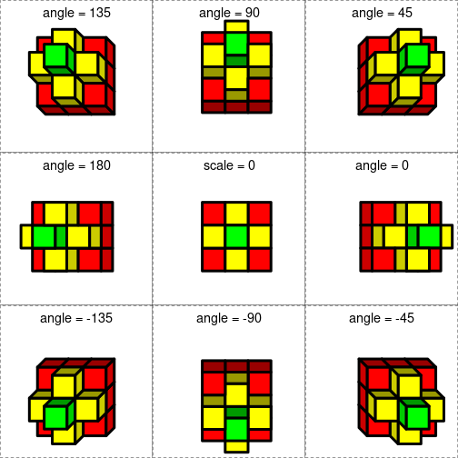
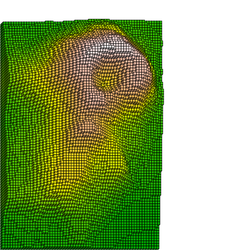
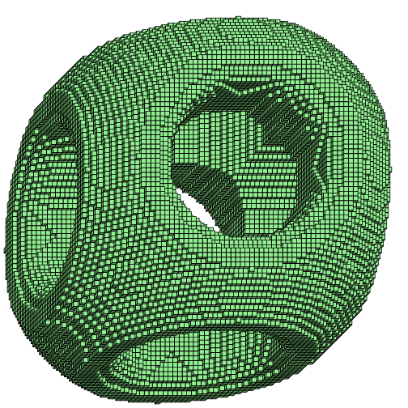
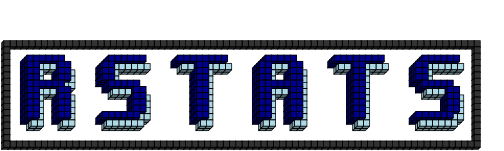
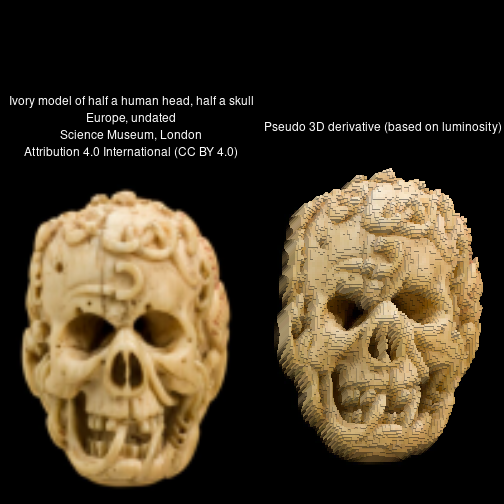
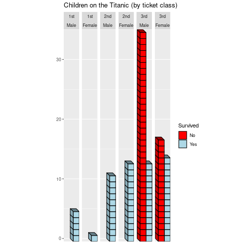

# oblicubes 

[](https://cran.r-project.org/package=oblicubes)
[](https://github.com/trevorld/oblicubes/actions)
[](https://app.codecov.io/gh/trevorld/oblicubes)

### Table of Contents

* [Overview](#overview)
* [Installation](#installation)
* [Examples](#examples)

  + [Different oblique projections](#oblique)
  + [Volcano heightmap](#volcano)
  + [Signed distance fields](#sdf)
  + [Generating fake terrain](#terrain)
  + [Bitmap fonts](#bitmap)
  + [Pseudo 3D images](#pseudo)
  + [3D bar charts](#3dbar)

* [Related software](#related)

## <a name="overview">Overview</a>

`{oblicubes}` is an extension for [coolbutuseless's](https://github.com/coolbutuseless) [{isocubes}](https://github.com/coolbutuseless/isocubes) that supports 3D graphics in `{grid}` and `{ggplot2}` by rendering cubes/cuboids with an [oblique projection](https://en.wikipedia.org/wiki/Oblique_projection) (instead of an [isometric projection](https://en.wikipedia.org/wiki/Isometric_projection)).  As a special case we also support "primary view orthographic projections" as well.  Like `{isocubes}` the `{oblicubes}` package only supports rendering non-rotated cubes (and cuboids) placed at integer coordinates.  If you need to do more complex oblique projections you'll need to use a package like [{piecepackr}](https://github.com/piecepackr/piecepackr) which supports additional shapes, supports adding art/text to their faces, rotating shapes, placing shapes at non-integer coordinates, etc.

| `{oblicubes}` | `{isocubes}` |
|---|---|
| [oblique projection](https://en.wikipedia.org/wiki/Oblique_projection), "primary view orthographic projection" | [isometric projection](https://en.wikipedia.org/wiki/Isometric_projection) | 
| right-handed coordinate system with z vertical  | left-handed coordinate system with y vertical |
| Use `xyz_heightmap()` to create x,y,z coordinates | Use `coord_heightmap()` to create x,y,z coordinates |
| Use `oblicubesGrob()`, `grid.oblicubes()`, or `geom_oblicubes()` to render image | Use `isocubesGrob()` to render image |
| Fast culling of non-visible cubes for "primary view orthographic projection".  Slower and less thorough culling of non-visible cubes for "oblique projection". | Fast culling of non-visible cubes. |

Inspired by [cj-holmes](https://github.com/cj-holmes)'s [{isocuboids}](https://github.com/cj-holmes/isocuboids) package this package also supports drawing [cuboids](https://en.wikipedia.org/wiki/Cuboid) in addition to cubes.  Using cuboids instead of cubes can provide significant speed advantages when rendering "height map" style images.

| `{oblicubes}` | `{isocuboids}` |
|---|---|
| [oblique projection](https://en.wikipedia.org/wiki/Oblique_projection), "primary view orthographic projection" | [isometric projection](https://en.wikipedia.org/wiki/Isometric_projection) | 
| right-handed coordinate system with z vertical  | left-handed coordinate system with y vertical |
| Use `xyz_heightmap(solid = FALSE)` to create x,y,z coordinates | Coordinates generated within image rendering functions |
| Use `oblicuboidsGrob()`, `grid.oblicuboids()`, or `geom_oblicuboids()` to render image | Use `cuboid_matrix()`, `cuboid_image()` to render image |

## <a name="installation">Installation</a>


```r
remotes::install_github("trevorld/oblicubes")
```

## <a name="examples">Examples</a>


### <a name="oblique">Different oblique projections</a>

`{oblicubes}` supports different oblique projection angles:


```r
library("grid")
library("oblicubes")
angles <- c(135, 90, 45, 180, 45, 0, -135, -90, -45)
scales <- c(0.5, 0.5, 0.5, 0.5, 0.0, 0.5, 0.5, 0.5, 0.5)
mat <- matrix(c(1, 2, 1, 2, 3, 2, 1, 2, 1), nrow = 3, ncol = 3)
coords <- xyz_heightmap(mat, col = c("red", "yellow", "green"))
vp_x <- rep(1:3/3 - 1/6, 3)
vp_y <- rep(3:1/3 - 1/6, each = 3)
for (i in 1:9) {
    pushViewport(viewport(x=vp_x[i], y=vp_y[i], width=1/3, height=1/3))
    grid.rect(gp = gpar(lty = "dashed"))
    grid.oblicubes(coords, width = 0.15, xo = 0.25, yo = 0.15,
                   angle = angles[i], scale = scales[i],
                   gp = gpar(lwd=4))
    if (i != 5)
        grid.text(paste("angle =", angles[i]), y=0.92, gp = gpar(cex = 1.2))
    else
        grid.text(paste("scale = 0"), y=0.92, gp = gpar(cex = 1.2))
    popViewport()
}
```



### <a name="volcano">Volcano heightmap</a>

* By default we do an oblique projection with a `scale` of 0.5 and an `angle` of 45.  This is also known as a "cabinet projection".
* Using cuboids instead of cubes can provide significant speed advantages when rendering "height map" style images.  


```r
library("grDevices")
library("ggplot2")
library("oblicubes")
data("volcano", package = "datasets")
df <- xyz_heightmap(volcano, scale = 0.3, min = 1, solid = FALSE)
g <- ggplot(df, aes(x, y, z = z, fill = raw)) +
       geom_oblicuboids(light = FALSE) +
       coord_fixed() +
       scale_fill_gradientn(name = "Height (m)",
                            colours=terrain.colors(256)) +
       labs(x = "East (10m)", y = "North (10m)",
            title = "Maungawhau (`datasets::volcano`)")
plot(g)
```



* By playing around with the `flipx`, `flipy`, `ground` arguments in `xyz_coords()` it is also possible to generate views from different sides of the object.  
* A `scale` of 0 gives you a "primary view orthographic projection".


```r
library("grDevices")
library("grid")
library("oblicubes")
data("volcano", package = "datasets")
mat <- 0.3 * (volcano - min(volcano)) + 1.0

grid.rect(gp=gpar(col=NA, fill="grey5"))
width <- convertWidth(unit(0.007, "snpc"), "cm")

# Top view
pushViewport(viewport(width = 0.7, height = 0.7, x = 0.65, y = 0.65))
coords <- xyz_heightmap(mat, col = terrain.colors, solid = FALSE)
grid.oblicubes(coords, scale = 0, width = width, gp = gpar(col=NA))
popViewport()

# South view
pushViewport(viewport(width = 0.7, height = 0.3, x = 0.65, y = 0.15))
coords <- xyz_heightmap(mat, col = terrain.colors, ground = "xz")
grid.oblicubes(coords, scale = 0, width = width, gp = gpar(col=NA))
popViewport()

# West view
pushViewport(viewport(width = 0.3, height = 0.7, x = 0.15, y = 0.65))
coords <- xyz_heightmap(mat, col = terrain.colors, ground = "zy")
grid.oblicubes(coords, scale = 0, width = width, gp = gpar(col=NA))
popViewport()
```


### <a name="sdf">Signed distance fields</a>

* [coolbutuseless's](https://github.com/coolbutuseless) [{isocubes}](https://github.com/coolbutuseless/isocubes) has [a bunch of functions](https://github.com/coolbutuseless/isocubes#whats-in-the-box) to create 3D objects with cubes using [signed distance fields (SDFs)](https://iquilezles.org/articles/distfunctions/).
* After generating such cube coordinates using `{isocubes}` you can use `{oblicubes}` as an alternate renderer.


```r
library("isocubes")
library("oblicubes")
sphere <- sdf_sphere() |> sdf_scale(40)
box <- sdf_box() |> sdf_scale(32)
cyl <- sdf_cyl() |> sdf_scale(16)
scene <- sdf_subtract_smooth(
  sdf_intersect(box, sphere),
  sdf_union(
    cyl,
    sdf_rotatey(cyl, pi/2),
    sdf_rotatex(cyl, pi/2)
  )
)
coords <- sdf_render(scene, 50)
grid.oblicubes(coords, fill = "lightgreen")
```



### <a name="terrain">Generating fake terrain</a>

* Here is an example generating fake terrain using "perlin noise" generated by the [{ambient}](https://github.com/thomasp85/ambient) package.


```r
library("ambient")
library("oblicubes")
n <- 72
set.seed(72)
mat <- noise_perlin(c(n, n), frequency = 0.042) |>
          cut(8L, labels = FALSE) |>
          matrix(nrow = n, ncol = n)
coords <- xyz_heightmap(mat, col = grDevices::topo.colors, solid = FALSE)
grid.oblicuboids(coords, gp = gpar(col = NA))
```


### <a name="bitmap">Bitmap fonts</a>


```r
library("bittermelon", warn.conflicts = FALSE)
library("oblicubes")
font_file <- system.file("fonts/spleen/spleen-8x16.hex.gz", package = "bittermelon")
font <- read_hex(font_file)
bml <- as_bm_list("RSTATS", font = font)
# Add a shadow effect and border
bm <- (3 * bml) |>
    bm_pad(sides = 2L) |>
    bm_shadow(value = 2L) |>
    bm_call(cbind) |>
    bm_extend(sides = 1L, value = 1L)
col <- apply(bm + 1L, c(1, 2), function(i) {
               switch(i, "white", "grey20", "lightblue", "darkblue")
             })
coords <- xyz_heightmap(bm, col = col, flipy = FALSE)
grid.oblicubes(coords)
```



### <a name="pseudo">Pseudo 3D images</a>

* [cj-holmes](https://github.com/cj-holmes)'s [{isocuboids}](https://github.com/cj-holmes/isocuboids) package has awesome builtin pseudo 3D image support
* With some work one can also do pseudo 3D images with `{oblicubes}`
* Image credit: Ivory model of a half a human head, half a skull, Europe, undated. [Science Museum, London](https://wellcomecollection.org/works/z3syda8c). [Attribution 4.0 International (CC BY 4.0)](https://creativecommons.org/licenses/by/4.0/)


```r
library("grDevices")
library("grid")
library("magick") |> suppressPackageStartupMessages()
library("oblicubes")
# Ivory model of half a human head, half a skull, Europe, undated
# Science Museum, London / CC BY 4.0
# https://wellcomecollection.org/works/z3syda8c
url <- "https://iiif.wellcomecollection.org/image/L0057080/full/760%2C/0/default.jpg"
if (!file.exists("ivory-skull.jpg"))
    download.file(url, "ivory-skull.jpg")
img <- image_read("ivory-skull.jpg") |>
    image_scale("20%") |>
    image_crop("100x150+26+18")
col <- as.matrix(as.raster(img))
# height by luminosity
rgb2lum <- function(x) (0.2126 * x[1] + 0.7152 * x[2] + 0.0722 * x[3]) / 255
mat <- col2rgb(col) |>
         apply(2, rgb2lum)  |>
         matrix(nrow = nrow(col), ncol = ncol(col))
df <- xyz_heightmap(mat, col, scale = 20, min = 1, solid = FALSE)
grid.newpage()
grid.rect(gp=gpar(fill="black"))
grid.raster(img, vp = viewport(x=0.25, width=0.5, just=c(0.5, 0.67)))
grid.text(paste("Ivory model of half a human head, half a skull",
                "Europe, undated",
                "Science Museum, London",
                "Attribution 4.0 International (CC BY 4.0)",
                sep = "\n"),
          x=0.26, y = 0.75, gp = gpar(col = "white"))
grid.oblicuboids(df, scale=0.5, gp=gpar(col=NA),
                 vp = viewport(x=0.75, width=0.5))
grid.text("Pseudo 3D derivative (based on luminosity)",
          x=0.76, y = 0.75, gp = gpar(col = "white"))
```



### <a name="3dbar">3D bar charts</a>

* **Should** you ever make a 3D bar chart?  Probably not...
* If you have integer valued y-values **could** you use `{oblicubes}` to make a 3D bar chart?  With some work...
* You can use `yoffset` and `zoffset` parameters to shift cubes so the top/bottom of the cubes lie on integer values (instead of the center of the cubes)


```r
library("dplyr", warn.conflicts = FALSE)
library("ggplot2")
library("oblicubes")
df <- as.data.frame(datasets::Titanic) |>
        filter(Age == "Child", Freq > 0) |>
        group_by(Sex, Survived, Class) |>
        summarize(Freq = seq.int(sum(Freq)), .groups = "drop")
ggplot(df, aes(x = Survived, y = Freq, fill = Survived)) +
    facet_grid(cols = vars(Class, Sex)) +
    coord_fixed() +
    geom_oblicubes(yoffset = -0.5, zoffset = -0.5, angle = -45, scale = 0.7) +
    scale_fill_manual(values = c("Yes" = "lightblue", "No" = "red")) +
    scale_y_continuous(expand = expansion(), name = "") +
    scale_x_discrete(name = "", breaks = NULL) +
    labs(title = "Children on the Titanic (by ticket class)")
```



## <a name="related">Related software</a>

* [{ambient}](https://github.com/thomasp85/ambient) generates various "noise".  "perlin noise" is often used to generate random terrains.
* [{ggrgl}](https://github.com/coolbutuseless/ggrgl) Also provides 3D cuboids rendering support (using `{ggplot2}` and `{rgl}`).
* [{isocubes}](https://github.com/coolbutuseless/isocubes) supports 3D rendering of cubes using an [isometric projection](https://en.wikipedia.org/wiki/Isometric_projection).  Direct inspiration for `{oblicubes}`.
* [{isocuboids}](https://github.com/cj-holmes/isocuboids) supports 3D rendering of cuboids using an isometric projection.  Specializes in the production of isometric pseudo 3-D images.  Direct inspiration for the `{oblicubes}` cuboid support.
* [{piecepackr}](https://github.com/piecepackr/piecepackr) supports 3D rendering using an oblique projection (as well as other projections).  Compared to `{oblicubes}` it supports more shapes, adding art/text to their faces, rotating shapes, placing shapes at non-integer coordinates, etc.  Specializes in the production of board game graphics.
* [{rayshader}](https://github.com/tylermorganwall/rayshader) creates beautiful 3D visualizations from elevation data using raytracing, hillshading algorithms, and overlays.
