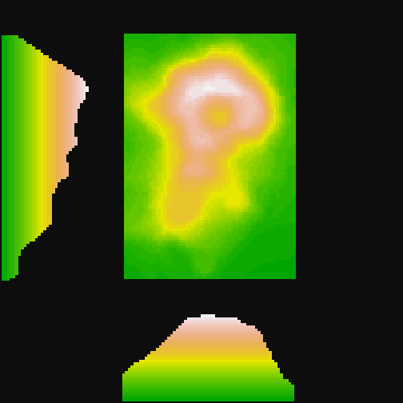
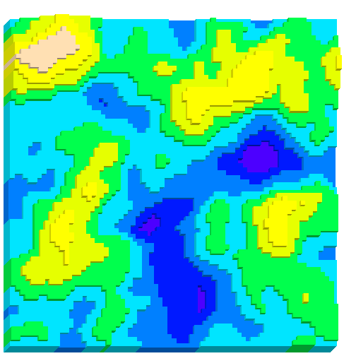

# oblicubes 

[](https://cran.r-project.org/package=oblicubes)
[](https://github.com/trevorld/oblicubes/actions)
[](https://codecov.io/gh/trevorld/oblicubes)

### Table of Contents

* [Overview](#overview)
* [Installation](#installation)
* [Examples](#examples)

  + [Different oblique projections](#oblique)
  + [Volcano heightmap](#volcano)
  + [Generating fake terrain](#terrain)
  + [Bitmap fonts](#bitmap)

* [Related software](#related)

## <a name="overview">Overview</a>

`{oblicubes}` is an extension for [coolbutuseless's](https://github.com/coolbutuseless) [{isocubes}](https://github.com/coolbutuseless/isocubes) that supports 3D graphics in `{grid}` by rendering cubes/cuboids with an [oblique projection](https://en.wikipedia.org/wiki/Oblique_projection) (instead of an [isometric projection](https://en.wikipedia.org/wiki/Isometric_projection)).  As a special case we also support "primary view orthographic projections" as well.  Like `{isocubes}` the `{oblicubes}` package only supports rendering non-rotated cubes (and cuboids) placed at integer coordinates.  If you need to do more complex oblique projections you'll need to use a package like [{piecepackr}](https://github.com/piecepackr/piecepackr) which supports additional shapes, supports adding art/text to their faces, rotating shapes, placing shapes at non-integer coordinates, etc.

| `{oblicubes}` | `{isocubes}` |
|---|---|
| [oblique projection](https://en.wikipedia.org/wiki/Oblique_projection), "primary view orthographic projection" | [isometric projection](https://en.wikipedia.org/wiki/Isometric_projection) | 
| right-handed coordinate system with z vertical  | left-handed coordinate system with y vertical |
| Use `xyz_heightmap()` to create x,y,z coordinates | Use `coord_heightmap()` to create x,y,z coordinates |
| Use `oblicubesGrob()`, `grid.oblicubes()`, or `geom_oblicubes()` to render image | Use `isocubesGrob()` to render image |
| Fast culling of non-visible cubes for "primary view orthographic projection".  Slower and less thorough culling of non-visible cubes for "oblique projection". | Fast culling of non-visible cubes. |

Inspired by [cj-holmes](https://github.com/cj-holmes)'s [{isocuboids}](https://github.com/cj-holmes/isocuboids) package this package also supports drawing [cuboids](https://en.wikipedia.org/wiki/Cuboid) in addition to cubes.  Using cuboids instead of cubes can provide significant speed advantages when rendering "height map" style images.

| `{oblicubes}` | `{isocuboids}` |
|---|---|
| [oblique projection](https://en.wikipedia.org/wiki/Oblique_projection), "primary view orthographic projection" | [isometric projection](https://en.wikipedia.org/wiki/Isometric_projection) | 
| right-handed coordinate system with z vertical  | left-handed coordinate system with y vertical |
| Use `xyz_heightmap(solid = FALSE)` to create x,y,z coordinates | Coordinates generated within image rendering functions |
| Use `oblicuboidsGrob()`, `grid.oblicuboids()`, or `geom_oblicuboids()` to render image | Use `cuboid_matrix()`, `cuboid_image()` to render image |

## <a name="installation">Installation</a>


```r
remotes::install_github("trevorld/oblicubes")
```

## <a name="examples">Examples</a>


### <a name="oblique">Different oblique projections</a>

`{oblicubes}` supports different oblique projection angles:


```r
library("grid")
library("oblicubes")
angles <- c(135, 90, 45, 180, 45, 0, -135, -90, -45)
scales <- c(0.5, 0.5, 0.5, 0.5, 0.0, 0.5, 0.5, 0.5, 0.5)
mat <- matrix(c(1, 2, 1, 2, 3, 2, 1, 2, 1), nrow = 3, ncol = 3)
coords <- xyz_heightmap(mat, col = c("red", "yellow", "green"))
vp_x <- rep(1:3/3 - 1/6, 3)
vp_y <- rep(3:1/3 - 1/6, each = 3)
for (i in 1:9) {
    pushViewport(viewport(x=vp_x[i], y=vp_y[i], width=1/3, height=1/3))
    grid.rect(gp = gpar(lty = "dashed"))
    grid.oblicubes(coords, width = 0.15, xo = 0.25, yo = 0.15,
                   angle = angles[i], scale = scales[i],
                   gp = gpar(lwd=4))
    if (i != 5)
        grid.text(paste("angle =", angles[i]), y=0.92, gp = gpar(cex = 1.2))
    else
        grid.text(paste("scale = 0"), y=0.92, gp = gpar(cex = 1.2))
    popViewport()
}
```


### <a name="volcano">Volcano heightmap</a>

By default we do an oblique projection with a `scale` of 0.5 and an `angle` of 45.  This is also known as a "cabinet projection":


```r
mat <- datasets::volcano
mat <- 0.3 * (mat - min(mat)) + 1.0
coords <- xyz_heightmap(mat, col = grDevices::terrain.colors)
grid.oblicubes(coords)
```


* By playing around with the `flipx`, `flipy`, `ground` arguments in `xyz_coords` it is also possible to generate views from different sides of the object.  
* A `scale` of 0 gives you a "primary view orthographic projection".


```r
library("grDevices")
mat <- datasets::volcano
mat <- 0.3 * (mat - min(mat)) + 1.0

grid.rect(gp=gpar(col=NA, fill="grey5"))
width <- convertWidth(unit(0.007, "snpc"), "cm")

# Top view
pushViewport(viewport(width = 0.7, height = 0.7, x = 0.65, y = 0.65))
coords <- xyz_heightmap(mat, col = terrain.colors, solid = FALSE)
grid.oblicubes(coords, scale = 0, width = width, gp = gpar(col=NA))
popViewport()

# South view
pushViewport(viewport(width = 0.7, height = 0.3, x = 0.65, y = 0.15))
coords <- xyz_heightmap(mat, col = terrain.colors, ground = "xz")
grid.oblicubes(coords, scale = 0, width = width, gp = gpar(col=NA))
popViewport()

# West view
pushViewport(viewport(width = 0.3, height = 0.7, x = 0.15, y = 0.65))
coords <- xyz_heightmap(mat, col = terrain.colors, ground = "zy")
grid.oblicubes(coords, scale = 0, width = width, gp = gpar(col=NA))
popViewport()
```



### <a name="terrain">Generating fake terrain</a>

Inspired by [cj-holmes](https://github.com/cj-holmes)'s [{isocuboids}](https://github.com/cj-holmes/isocuboids) package this package also supports drawing [cuboids](https://en.wikipedia.org/wiki/Cuboid) in addition to cubes.  Using cuboids instead of cubes can provide significant speed advantages when rendering "height map" style images.  Here is an example generating fake terrain using "perlin noise" generated by the [{ambient}](https://github.com/thomasp85/ambient) package.


```r
library("ambient")
n <- 72
set.seed(72)
mat <- noise_perlin(c(n, n), frequency = 0.042) |>
          cut(8L, labels = FALSE) |>
          matrix(nrow = n, ncol = n)
coords <- xyz_heightmap(mat, col = grDevices::topo.colors, solid = FALSE)
grid.oblicuboids(coords, gp = gpar(col = NA))
```



### <a name="bitmap">Bitmap fonts</a>


```r
library("bittermelon")
```

```
## 
## Attaching package: 'bittermelon'
```

```
## The following object is masked from 'package:base':
## 
##     which
```

```r
font_file <- system.file("fonts/spleen/spleen-8x16.hex.gz", package = "bittermelon")
font <- read_hex(font_file)
bml <- as_bm_list("RSTATS", font = font)
# Add a shadow effect and border
bm <- (3 * bml) |>
    bm_pad(sides = 2L) |>
    bm_shadow(value = 2L) |>
    bm_call(cbind) |>
    bm_extend(sides = 1L, value = 1L)
col <- apply(bm + 1L, c(1, 2), function(i) {
               switch(i, "white", "grey20", "lightblue", "darkblue")
             })
coords <- xyz_heightmap(bm, col = col, flipy=FALSE)
grid.oblicubes(coords, width=unit(2.2, "mm"))
```


## <a name="related">Related software</a>

* [{ambient}](https://github.com/thomasp85/ambient) generates various "noise".  "perlin noise" is often used to generate random terrains.
* [{ggrgl}](https://github.com/coolbutuseless/ggrgl) Also provides 3D cuboids rendering support (using `{ggplot2}` and `{rgl}`).
* [{isocubes}](https://github.com/coolbutuseless/isocubes) supports 3D rendering of cubes using an [isometric projection](https://en.wikipedia.org/wiki/Isometric_projection).  Direct inspiration for `{oblicubes}`.
* [{isocuboids}](https://github.com/cj-holmes/isocuboids) supports 3D rendering of cuboids using an isometric projection.  Specializes in the production of isometric pseudo 3-D images.  Direct inspiration for the `{oblicubes}` cuboid support.
* [{piecepackr}](https://github.com/piecepackr/piecepackr) supports 3D rendering using an oblique projection (as well as other projections).  Compared to `{oblicubes}` it supports more shapes, adding art/text to their faces, rotating shapes, placing shapes at non-integer coordinates, etc.  Specializes in the production of board game graphics.
* [{rayshader}](https://github.com/tylermorganwall/rayshader) creates beautiful 3D visualizations from elevation data using raytracing, hillshading algorithms, and overlays.
